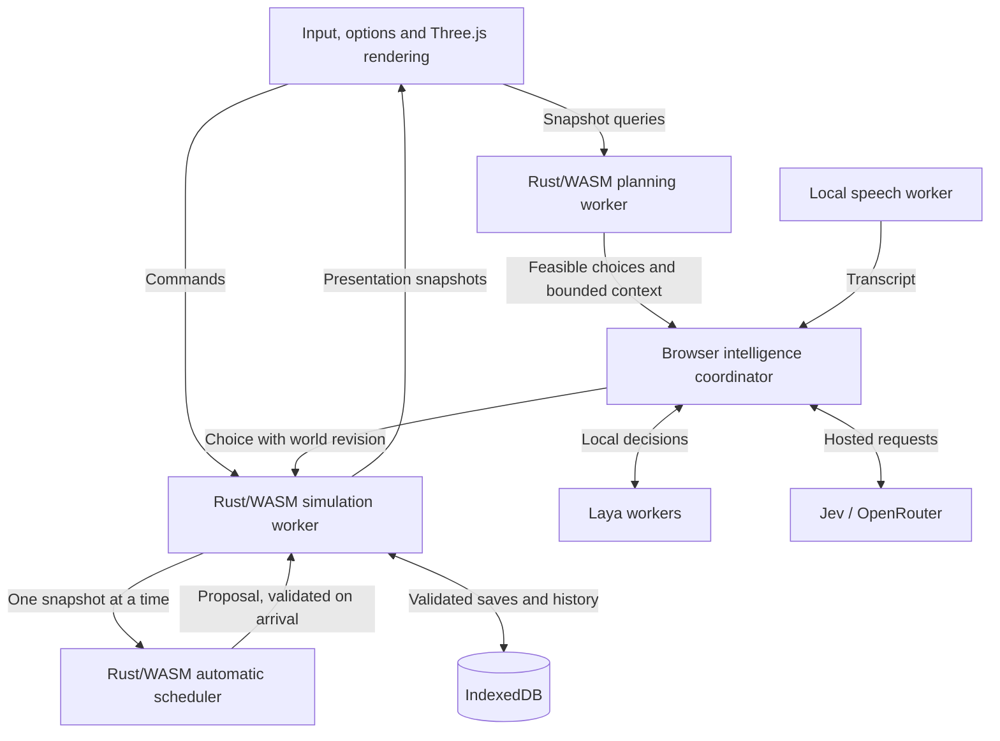

# Tripelkins architecture

Tripelkins is a static browser game. A Rust/WASM worker owns the world; browser
code draws it, handles input and connects optional models. There is no game
server. [Documentation index](README.md) · [Contributor guide](../CONTRIBUTING.md)

## One authoritative world

The main thread sends commands to the simulation worker. That worker advances
needs, movement, jobs, resources, growth and story on a fixed 100 ms simulation
step. It sends bounded snapshots back for rendering. A separate Rust/WASM worker
calculates model choices and context from snapshots. A dedicated snapshot
scheduler calculates the automatic two-second crew plan and development summary;
it has at most one request in flight. These searches no longer occupy a movement
tick or wait behind model-context requests. All three workers execute Rust/WASM.

The live scheduler rechecks map and command revisions, population, resources,
targets and service reservations before committing a proposal. Proposals older
than three playing seconds are rejected. Completed jobs retain their outcomes
and cargo, and a newer AI schedule supersedes an automatic proposal. Pausing and
restoring invalidate outstanding work. A helper failure falls back to synchronous
scheduling. The synchronous entry point remains available for deterministic
replays; live proposals can arrive between ticks, so their assignment timing is
not a bit-for-bit replay of that entry point.

All state changes are committed by the simulation worker. Model outputs cannot
write arbitrary world state. A choice is expanded and checked against the
current world before assignments apply. World generation and command revision
checks discard stale work after restoration or newer commands.

## Where the rules live

| Responsibility | Authoritative source |
| --- | --- |
| Needs, multiplication, physical work and resources | `engine/src/simulation.rs`, `jobs.rs`, `resources.rs` |
| Terrain, discovery, collision and paths | `engine/src/terrain.rs`, `discovery.rs`, `geometry.rs`, `navigation.rs` |
| Blocked work, clearing and local crews | `engine/src/access.rs`, `development.rs` |
| Groups, goals, development, outposts and context | `engine/src/planning.rs`, `goals.rs`, `development.rs`, `outposts.rs`, `context.rs` |
| Save validation, timelines and restoration algorithms | `engine/src/save.rs`, `timeline.rs` |
| Worker lifecycle and browser persistence | `src/engine/`, `src/persistence.js` |

The JavaScript rules under `src/game/` remain a comparison reference and support
older diagnostics. Presentation helpers are still used by the renderer. The
[migration report](RUST_ENGINE_MIGRATION.md) defines this boundary, and the
[generated contract](generated/engine-contract.md) inventories engine operations.
These are internal application interfaces, not a stable external SDK.

## Rendering and sound

`src/world.js` renders Three.js sprites and terrain. `src/game/art.js` generates
textures; `src/fog.js` presents discovered areas. `src/colony-life.js` coordinates
local reactions with `src/creature-voice.js` and the Web Audio engine. Camera,
DOM, microphone permission and audio remain browser responsibilities.

Only one presentation snapshot may be awaiting acknowledgment, preventing an
unbounded rendering backlog. This keeps simulation throughput separate from
frame responsiveness. An expanded 600-resident workload can still run slower
than real time; smooth drawing does not imply unlimited simulation capacity.
See the measured workload in the [migration report](RUST_ENGINE_MIGRATION.md).

## Intelligence and conversation

`src/brain.js` coordinates group schedules, development choices and conversations.
Rust constructs feasible choices using care, inventory, access, commitments,
local demand and goals. Laya, Jev or the chat adapter selects a bounded choice;
the engine validates it again before committing physical work.

Laya runs in dedicated WASM or WebGPU workers. The one-to-three worker setting
limits concurrent model work; it does not change the number of simulation
workers. Hosted providers use the same request cap. Request cadence is measured
in playing time and can respond sooner to meaningful events. See
[intelligence controls](INTELLIGENCE_CONTROLS.md).

Whisper Base English transcribes locally in a separate worker. Capture is bounded
and raw recordings do not enter world saves. Conversations and commands become
bounded history used by future context. Hosted requests can include recognized
text. [Voice](VOICE.md) and [data boundaries](../SECURITY.md) describe the adapters.

## Saves, pause and failure

The simulation worker calls the IndexedDB adapter in `src/persistence.js`.
Rust validates saves and manages snapshots, bounded timeline changes and
compaction. Restore adopts validated state without replaying elapsed simulation
or issuing old model requests. A restored world opens paused.

Options, explicit pause and hidden tabs stop advancement; there is no offline
catch-up. Save operations are ordered with simulation commands. A write conflict
pauses this tab. Quota or write failures preserve the live world for export and
retry. A browser close can interrupt an unfinished write; the latest completed
autosave is the recovery boundary.

World exports preserve the colony, not the full rewind database or model cache.
Origins and browser profiles have independent storage. See
[context and recovery](CONTEXT_ARCHITECTURE.md).

## Hosting and generated output

Vite emits the static `dist/` site with relative URLs for `/tripelkins/` or a
custom-domain root. Build preparation compiles the locked engine, copies matching
ONNX loaders/binaries and generates component notices. Worker instances do not
require shared memory or cross-origin isolation headers.

The build manifest records file sizes and SHA-256 hashes. Pages CI compares the
published files with a build of the same commit in its Linux environment.
[Deployment](DEPLOYMENT.md) explains that verification, browser checks and rollback.
