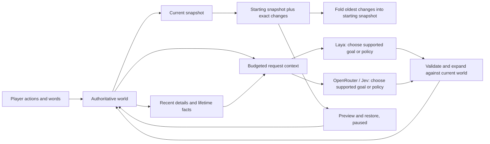

# State, history and model context

Architecture review and implementation, 24 September 2026.

The current implementation uses world schema 4 and IndexedDB version 10. Jev now uses the dedicated typed Decisions adapter; chat completions remain a separate optional provider. Identity, typed cargo, work commitments, bridge geometry, story/evidence, directives, decision outcomes and district/orbital ledgers are normalized into snapshots. Derived path, traffic and model caches are rebuilt.

## Decisions

Use **a complete current save, a base snapshot plus bounded exact changes, and deterministic long-term memory**. Build model input separately for each request. The world is authoritative; a model's story about the world is never used to restore it.

This is a sampled state timeline, not event sourcing of every animation frame. Rewind points are created by meaningful autosaves and explicit saves. Reconstructing a point applies stored changes; it never reruns physics, resends a command, calls OpenRouter, or relies on a model producing the same result again.

## What was wrong with the previous architecture

| Area          | Finding                                                                                                                               | Decision                                                                                                                                              |
| ------------- | ------------------------------------------------------------------------------------------------------------------------------------- | ----------------------------------------------------------------------------------------------------------------------------------------------------- |
| History       | Snapshots, 160 recent events and a separate 512-entry journal were independently trimmed. They did not form a replayable timeline.    | Store exact state changes relative to a retained base. The current snapshot remains the fast startup path.                                            |
| Restore       | Replacing the world cleared the separate journal. Event IDs restart after rewind, and there was no identity for the path left behind. | Retain bounded, independently identified paths; restore starts a new path. Store the selected moment's origin.                                        |
| Commands      | Only successful replies were recorded. Download failure, cancellation, page reload or API rejection could lose the user's words.      | Save the submitted command first, then its outcome. Pending commands become interrupted on restart or restore; never auto-resend them.                |
| Compaction    | Older prose disappeared, with only some event counters left.                                                                          | Preserve lifetime counters, active goals, lasting choices and a bounded milestone summary, explicitly separate from recent verbatim details.          |
| OpenRouter    | Full object lists and five copies of per-creature assignments could be sent without a request budget.                                 | Send global state, goals, compact group statistics, selected history and optional work summaries. Generate and validate full assignments in the game. |
| Laya          | Blind token truncation could remove the end of a command or important state.                                                          | Tokenize and fit whole prioritized context parts. A command must fit in full or fail visibly with a request for shorter wording.                      |
| Multiple tabs | An older tab could overwrite a newer save.                                                                                            | Compare the stored version in the same transaction as the write; reject stale writers and pause that tab.                                             |

## 1. Authoritative state and restart

`active-world` remains a complete normalized schema-4 world (schema-1, schema-2 and schema-3 saves migrate on load) in IndexedDB. It includes simulation time, RNG seed, IDs, individuals and their needs/tasks/positions/timers, objects/stock/progress, inventory, progression flags, numerical cohort, goals, memories, UI selection/camera/settings and save time.

It excludes API keys, microphone recordings, GPU/ONNX tensors, worker handles, pathfinding caches and live requests. Derived navigation and inference caches are rebuilt. Normalization now creates an empty state shell instead of regenerating the forest on every save.

Startup reads the active save and history version in one transaction. Dangerous colonies pause. Pending commands become `interrupted`; their text stays available. Goal progress remains in the snapshot and is measured by the simulation after resume. No offline catch-up or inference replay occurs. The existing previous-save fallback and prototype archive remain available.

All newly restored/imported worlds open paused. Fresh-care restoration is still a distinct, explicit player choice. This work does not apply a restore to the player's colony.

## 2. Timeline and compaction

A versioned `timeline-v1` record lives in the existing `worlds` store. The database is now version 4 without clearing existing stores or records. Version 3 fenced clients without the history writer check; version 4 also fences clients that clamp saved positions to the former finite map. Existing recovery snapshots are retained separately; history starts with the first save after this upgrade. Missing older time-series data cannot be invented.

Each retained path contains:

- A unique path ID, previous-path link and, for timeline restores, the source path/moment.
- One complete base snapshot with a unique moment ID and wall-clock timestamp.
- Ordered frames with unique moment IDs, timestamp, simulation tick, population and exact changes.
- A count of frames already folded into the base.

Changes recurse through objects and replace changed arrays as a unit. This deliberately favors a simple, inspectable codec over a complex per-entity compression format. It is exact for normalized JSON state, not a lossy natural-language summary. Old arrays in a retained base are replaced only after their corresponding changes have been applied.

**Limits:** four paths; at most 120 change frames per path; at most **8 MiB of serialized timeline data in total**, including bases and metadata. The byte limit wins if reached first. Compaction applies the oldest frame to its base before deleting that frame. Old paths can eventually be evicted in full. A frame that is no longer retained cannot be restored.

At a five-second autosave cadence, 120 frames are roughly ten minutes of detailed history. UI changes, command saves, colony size and the byte cap can shorten that window. Unchanged saves do not create frames. There is no guarantee of ten minutes or unlimited rewind.

The current snapshot, timeline, outgoing archive, restore source and bounded journal are committed in one IndexedDB transaction. The running world is swapped only after the replacement commits. A compare-and-swap version check prevents two upgraded tabs from silently overwriting one another. Older pre-upgrade tabs receive the IndexedDB version-change notification, close their connection, and cannot reopen the upgraded database using version 2 or 3. They need a reload to use the new code.

## 3. Long-term memory

| Data                       | Bound and meaning                                                                                       |
| -------------------------- | ------------------------------------------------------------------------------------------------------- |
| Live individuals / objects | 192 / 768; larger populations remain numerical cohorts                                                  |
| Recent narrative events    | 160; simulation tick plus wall-clock date for newly recorded events                                     |
| Event-kind lifetime totals | 64 keys; counts survive recent-event compaction                                                         |
| Milestone summary          | Last 24 selected important events, with original wording and tick                                       |
| Submitted commands         | Last 96, each up to 500 characters of input and 500 of reply                                            |
| Command record             | Unique ID, typed/voice origin, listener, tick/date, outcome, provider description and resulting goal ID |
| Older commands             | Count retained; full wording eventually discarded. Active goal commands still persist with their goals. |
| Conversation compatibility | Last 24 successful conversations; pre-upgrade conversations remain readable in the journal              |
| Goals                      | 8 unfinished and 12 closed; up to 8 recent reviews per goal                                             |
| Lasting choices            | Last 32 entries                                                                                         |
| Completed jobs             | Last 64 plus bounded lifetime task totals                                                               |
| Existing journal store     | 512 entries; retained for compatibility, not used to reconstruct a world                                |

Compaction is deterministic and requires no model call. It cannot hallucinate a building, invent a promise or change a creature's needs. Lifetime totals are exact for the events recorded by the game; a 24-milestone summary is selective, not a complete verbatim record of everything ever said.

A command is saved before inference. Its outcome is `pending`, `completed`, `failed`, `cancelled` or `interrupted`. Only a validated, successfully returned goal changes the goal queue. A failed/cancelled message is historical data, not an instruction to execute later. The raw audio is never stored.

## 4. Laya and Jev / OpenRouter

### Common contract

Both providers select a supported goal or one of five schedule policies. The game expands the selected policy into a current assignment for each represented creature, then validates IDs, capacity and reachability. In-flight decisions have age/generation/goal checks. Persistent goals are measured and completed by game rules, not by model claims.

The rich internal context remains available in Advanced for inspection. It contains groups, objects, player viewport, recent events, goals, commands and candidate schedules. It is not automatically sent in full.

### Laya

Laya is a classifier in this implementation. It does not generate arbitrary English narratives or maintain an unlimited private memory. Local reply subtitles are authored game responses; the model interprets supported goals and schedule choices.

- Schedule input: up to 192 tokens total, including question/options/separators.
- Command interpretation: up to 320 tokens, also capped by the loaded model's `max_len`.
- Exact tokenizer accounting occurs in the worker.
- Priorities: global lowest needs; active goal/blocker; care facilities; bridge/resources; most endangered groups; compact lifetime facts.
- A command's full text is mandatory. If it cannot fit after question/options, request shorter wording; never infer from a silently clipped instruction.
- Other context parts fit whole or are omitted. Actual token count and omitted-part count are diagnostic data.
- One bounded worker/session and cache remain in use. History does not accumulate in the model session.

### OpenRouter / Jev

Jev uses the configured OpenRouter model and endpoint; the app does not assume a universal Jev context size. The client looks up the selected model's advertised context/output limits via the models API and caches that metadata for ten minutes, with at most eight entries. If metadata is unavailable, a conservative 4,096-token planning assumption is used and identified as unverified in diagnostics.

The request reserves space for system instructions, response schema, current command, output and a 512-unit margin. The state projection has a hard cap of 20,000 UTF-8 bytes and a smaller allowance when the model requires it. UTF-8 bytes are a conservative proxy for common tokenizers, **not an exact count for an arbitrary hosted tokenizer**. Unusual/custom endpoints can still reject a request; that error is retained as a failed command, without replay or partial goal execution.

Essential state must fit: time, population, represented count, stage, inventory, bridge, pollution, global minimum needs, current goal and supported policies. Optional context is added whole or dropped to fit: facility counts, player view, group summaries, recent completed/failed commands, choices, totals, milestones, goal queue, recent events, summarized group work, a labeled object sample and recent replies. Older history is explicitly presented as data, not fresh instructions.

The current command is never truncated to make a hosted request fit. Server-side message transforms are disabled so a provider cannot silently replace our deliberate projection with different dropped messages. The actual packed context and budget are inspectable in Advanced. Provider errors remain possible; context fitting is not a claim of universal model compatibility.

Primary references: [model metadata](https://openrouter.ai/docs/api/api-reference/models/get-models), [message transforms and overflow behavior](https://openrouter.ai/docs/guides/features/message-transforms), [request parameters](https://github.com/OpenRouterTeam/docs/blob/main/api_reference/parameters.mdx).

## 5. Space, portability and privacy

The 8 MiB limit applies to rewind data, not all browser storage. A bounded set of full current/recovery snapshots and memory lives alongside it. Model weights in CacheStorage are much larger. Laya and Whisper download checks now reserve 32 MiB for saves and other overhead. Browser estimates, quota and eviction remain controlled by the browser; no frontend can promise that disk space will never run out.

On quota failure, the existing recovery path evicts re-downloadable model caches and retries the save; it does not erase history to make a failed transaction appear successful. Save failures stay visible. Current-world export includes its bounded story, goals and commands, but **not every rewind path**. Import opens the exported world as a new paused path. Old JSON exports remain supported.

Localhost and GitHub Pages have separate origin storage. Download/open a world to transfer it. No automatic cloud synchronization is implied. API keys stay in the tab and are neither saved nor exported. OpenRouter receives selected game context and submitted text only when that provider is used; local Laya/Whisper inference stays on the device after downloads.

## 6. Player experience

**Options → Saved worlds → Read our story & earlier moments** shows:

1. Recent words and whether the colony answered.
2. Milestones and lifetime totals under “What we remember from before.”
3. A dated moment selector, grouped into the current story and earlier paths.
4. “Preview this moment,” followed by the existing health preview and paused restore choice.

No branch, database, tokenizer or compaction controls are required. The UI explains that older moments eventually roll off. Model/context/storage diagnostics remain in Advanced.

## Review evidence and remaining verification

- Production bundle compiled after the storage/context changes.
- Inspected the live local story UI, populated dates and saved-moment selector.
- Opened an earlier retained moment's preview without applying a restore or changing the colony's needs.
- Source review covered save transaction ordering, writer conflict checks, compaction's base advancement, restore interruption of commands, bounded prompt construction and worker token accounting.
- No automated regression suite was added or run in this task. The earlier request for that authorization was unanswered. No authenticated OpenRouter request, real microphone recording, forced quota failure, cross-tab race or maximum-size compaction run is claimed as verified.
- Follow-up regression coverage should use disposable worlds and a separate IndexedDB: snapshot-plus-delta equality; deletion/array changes; compaction equivalence; old-path retention; failed commits; stale writers; pending-command restarts; command lifecycle; and token/byte bounds with long Unicode input. Measure main-thread save cost at the maximum retained size before making latency guarantees.

## Procedural terrain

Snapshots now include the immutable terrain seed/generator version and bounded chunk edit masks, plus unrestricted colony/camera positions within the numerical safety range. Generated textures and unchanged natural objects are derived data and never enter the timeline. A restored snapshot recreates its own terrain and cleared-resource state. AI context includes a bounded sample around the player’s view and region-based groups; excess regions merge into a summary group so all individual creatures remain represented. No model receives an ever-growing map. See [procedural world architecture](PROCEDURAL_WORLD.md).
